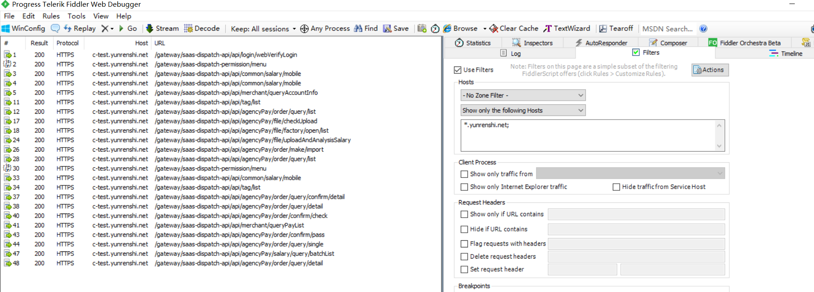

[TOC]
## 一、Fiddler接口录制
### 1.http接口录制
### 2.https接口录制
fiddler设置https
fiddler过滤待录制接口的域名
### 3.删掉录制的冗余接口
删除冗余接口前
删除冗余接口后
### 4.保存接口信息到saz文件

## 二、Yapi的部署
### 1.yapi后台去掉录制接口时的重复接口检查


### 2.yapi部署
yapi二次开发部署请参考：https://www.cnblogs.com/ycyzharry/p/10338870.html

本项目是在yapi 1.8.1下进行开发的,如有发现获取yapi的token失败的情况，请自己实现获取token的方式
## 三、解析saz文件录制到yapi对应的项目中
### 1.yapi新建组名和项目名

### 2.导入saz到项目
```bash
$ npm start

-h,-help  print help list
saz  assign fidder saz file path,eg:saz=test.saz
ip  assign yapi domain or ip,eg:ip=xxx.xxx.xxx.xxx
user  assign yapi login user,eg:user=admin@admin.com
passwd  assign yapi login password,eg:passwd=123456
gname  assign yapi exist group,eg:gname=Auto
pname  assign yapi exist projectName,eg:pname=AutoProject
cname  assign yapi case collection name,eg:cname=login


$ npm start saz=批量发薪.saz ip=127.0.0.1 user=admin@admin.com passwd=123456 gname=saas接口测试 pname=接口录制demo cname=批量发薪

```
### 3.查看导入后的结果
录制的接口
生成的case